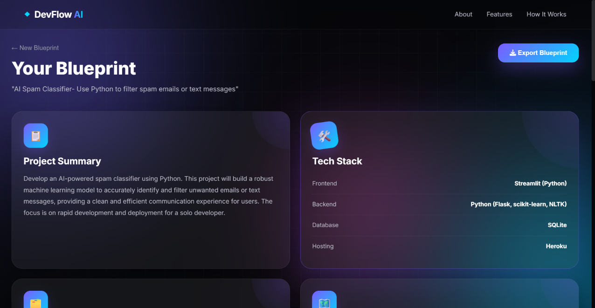

# DevFlow-AI
# 🚀 DevFlow AI

> Transform your project ideas into complete software blueprints using Google's Gemini AI.

DevFlow AI is an AI-powered web application that generates a complete project development plan from a simple idea. It provides a recommended tech stack, folder structure, roadmap, features, APIs, challenges, AI tips, and an overall difficulty estimate.

---

## ✨ Features

- 🧠 AI-generated project blueprint
- 🛠️ Recommended tech stack
- 📁 Folder structure generation
- 🗺️ Development roadmap
- ✅ Key feature suggestions
- 🔌 Third-party API recommendations
- ⚠️ Technical challenges
- 💡 AI implementation tips
- 📊 Project difficulty estimation
- 📄 Export blueprint as PDF
- 🎨 Modern Glassmorphism UI

---

## 📸 Screenshots

> Add screenshots of your project here.

### Landing Page


### Generated Blueprint



---

## 🛠️ Tech Stack

### Frontend

- HTML5
- CSS3
- JavaScript (ES6)

### Backend

- Node.js
- Express.js

### AI

- Google Gemini API

### Libraries

- html2pdf.js
- dotenv

---

## 📂 Project Structure

```
DevFlow-AI/
│
├── frontend/
│   ├── index.html
│   ├── style.css
│   ├── script.js
│
├── server.js
├── package.json
├── .gitignore
└── README.md
```

---

## ⚙️ Installation

Clone the repository

```bash
git clone https://github.com/YourUsername/DevFlow-AI.git
```

Go inside the project

```bash
cd DevFlow-AI
```

Install dependencies

```bash
npm install
```

Create a `.env` file

```env
GEMINI_API_KEY=YOUR_API_KEY
GEMINI_MODEL=gemini-2.5-flash
PORT=3000
```

Run the server

```bash
npm start
```

Open

```
http://localhost:3000
```

---

## 🔑 Environment Variables

| Variable | Description |
|----------|-------------|
| GEMINI_API_KEY | Your Google Gemini API Key |
| GEMINI_MODEL | Gemini model name |
| PORT | Server port |

---

## 🚀 Deployment

This project can be deployed on:

- Render
- Railway
- Vercel (Frontend)
- Netlify (Frontend)

---

## 🎯 Future Improvements

- User authentication
- Save previous blueprints
- Multiple export formats
- Dark/Light theme
- Project sharing
- Database integration
- AI chat assistant

---

## 👩‍💻 Author

**Shrena Reddy**

GitHub: https://github.com/ShrenaReddy

---
