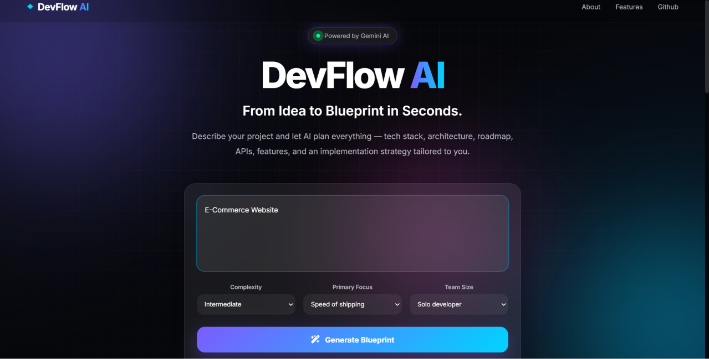
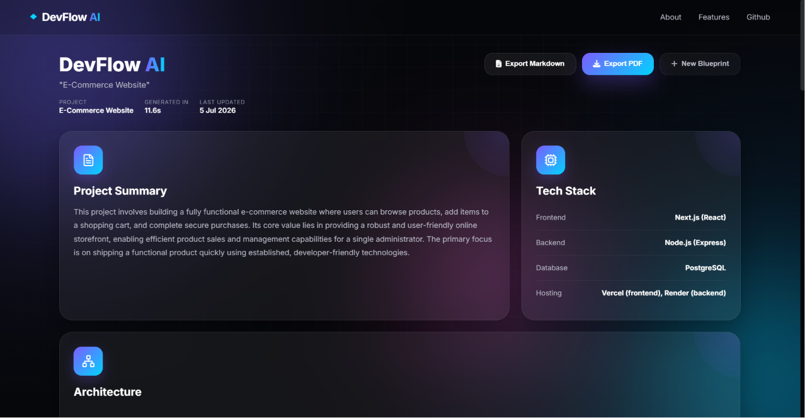
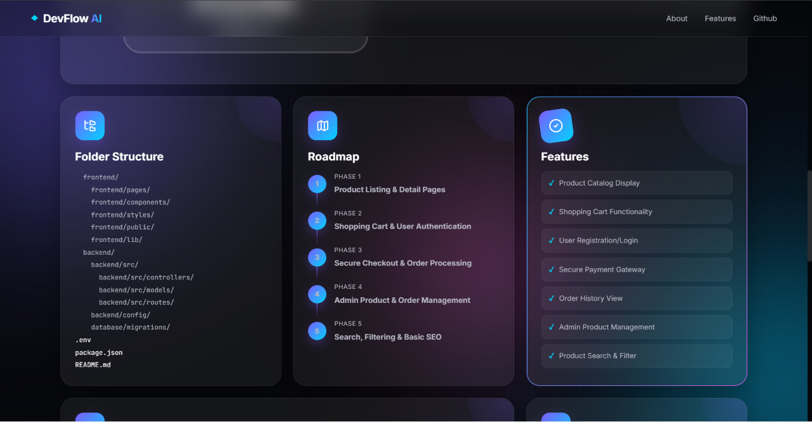

# 🚀 DevFlow AI

> **Transform your project idea into a complete development blueprint using AI.**

DevFlow AI is an AI-powered project planning platform that helps developers convert a simple idea into a structured software development roadmap. It generates project summaries, recommended tech stacks, folder structures, APIs, architecture diagrams, implementation roadmaps, AI guidance, and much more—all in a beautiful modern dashboard.

---

## ✨ Features

### 🤖 AI Project Blueprint
Generate a complete software development blueprint from a single project idea.

Includes:
- Project Summary
- Recommended Tech Stack
- Folder Structure
- Development Roadmap
- Core Features
- Recommended APIs
- Challenges
- AI Implementation Tips
- Project Difficulty Score

---

### 🏗 Architecture Diagram

Automatically generates a visual architecture diagram showing how the frontend, backend, database, and APIs interact.

---


### 📄 Export Options

Download your blueprint as:

- PDF
- Markdown (.md)

Perfect for documentation or GitHub projects.

---

### 📋 Deployment Checklist

DevFlow AI includes a built-in **Deployment Checklist** to help developers ensure their project is ready for production. Before deployment, users can review a checklist of essential tasks, making the deployment process more organized and reducing the chances of common configuration errors.

The checklist includes:

- ✅ Environment variables configured
- ✅ API keys added securely
- ✅ Database connection verified
- ✅ Production build completed
- ✅ Hosting platform configured
- ✅ Security and HTTPS checks
- ✅ Final deployment readiness verification

This feature helps developers confidently deploy their applications by following a structured pre-deployment workflow.

### 🎨 Modern UI

Designed with inspiration from:

- Linear
- Notion
- Apple
- Glassmorphism

Features include:

- Responsive Bento Dashboard
- Lucide Icons
- Smooth Animations
- Interactive Cards
- Glassmorphism UI
- Premium Hover Effects
- Loading Animations
- Deployment Checklist

---

## 🛠 Tech Stack

### Frontend

- HTML5
- CSS3
- JavaScript (ES6)
- Lucide Icons

### Backend

- Node.js
- Express.js

### AI

- Google Gemini 2.5 Flash API

### Deployment

- Render

---

## 📂 Project Structure

```
DevFlow-AI/
│
├── frontend/
│   ├── index.html
│   ├── index.css
│   ├── index.js
│   └── assets/
│
├── server.js
├── package.json
├── .env
└── README.md
```

---

## ⚙ Installation

Clone the repository

```bash
git clone https://github.com/YOUR_USERNAME/DevFlow-AI.git
```

Go inside the project

```bash
cd DevFlow-AI
```

Install dependencies

```bash
npm install
```

Create a `.env` file

```env
GEMINI_API_KEY=YOUR_API_KEY
GEMINI_MODEL=gemini-2.5-flash
PORT=3000
```

Run

```bash
npm start
```

Visit

```
http://localhost:3000
```

---

## 📸 Screenshots

### Landing Page



---

### Generated Blueprint Dashboard



---


### RoadMap, Features and Folder Structure



---

## 🎯 Why DevFlow AI?

Developers often spend hours deciding:

- Which tech stack to use
- Folder structure
- APIs
- Development roadmap
- Deployment strategy

DevFlow AI generates a complete project plan within seconds, allowing developers to focus on building instead of planning.

---

## 🚀 Future Improvements

- Multiple Blueprint Templates
- Authentication
- Blueprint History
- Team Collaboration
- Dark / Light Themes
- Project Versioning
- Multiple AI Model Support

---

## 👩‍💻 Author

**Shrena Reddy**

Developed as a submission for the **Being Infinity AI Hackathon**, showcasing the use of Generative AI to simplify software project planning and architecture design.

---